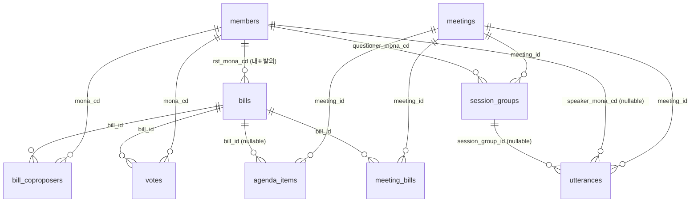

# ERD — Congress-DB (Postgres 16)

10개 핵심 테이블 + 카탈로그 1개. 모든 식별자는 자연키 우선 (`MONA_CD`, `BILL_ID`, `mnts_id`). FK는 ON DELETE RESTRICT (참조 무결성 우선).

## Mermaid 다이어그램



## 테이블 정의

### 1. `members` — 의원

22대 286명. API `nwvrqwxyaytdsfvhu` (의원 인적사항)에서 그대로.

| 컬럼 | 타입 | 비고 |
|---|---|---|
| `mona_cd` | TEXT | **PK**. 의원 고유 코드. 대수 무관. |
| `hg_nm` | TEXT NOT NULL | 한글 이름 |
| `hj_nm` | TEXT | 한자 이름 (정보용) |
| `eng_nm` | TEXT | 영문 이름 |
| `bth_date` | DATE | 생년월일 |
| `sex_gbn_nm` | TEXT | 성별 |
| `poly_nm` | TEXT | **현재** 정당 |
| `orig_nm` | TEXT | **현재** 선거구 |
| `elect_gbn_nm` | TEXT | 지역구 / 비례대표 |
| `cmits` | TEXT | **현재** 위원회 (콤마 구분 텍스트, API 원본 그대로) |
| `reele_gbn_nm` | TEXT | 초선 / 재선 / ... |
| `units` | TEXT | 역대 ("제21대, 제22대" 텍스트 그대로) |
| `tel_no` | TEXT | |
| `e_mail` | TEXT | |
| `homepage` | TEXT | |
| `mem_title` | TEXT | 약력 텍스트 (긴 자유 텍스트) |
| `assem_addr` | TEXT | 의원회관 호실 |
| `fetched_at` | TIMESTAMPTZ DEFAULT now() | 마지막 수집 시각 |

**인덱스**: `hg_nm` (이름 검색), `poly_nm` (정당 필터).

---

### 2. `bills` — 법안

22대 17,286+. API `nzmimeepazxkubdpn` + `BPMBILLSUMMARY`.

| 컬럼 | 타입 | 비고 |
|---|---|---|
| `bill_id` | TEXT | **PK**. `PRC_xxx` 형식. |
| `bill_no` | TEXT UNIQUE NOT NULL | 7자리 보조키 |
| `bill_name` | TEXT NOT NULL | 법안명 |
| `propose_dt` | DATE | 발의일자 |
| `rst_mona_cd` | TEXT REFERENCES members(mona_cd) | 대표발의자 |
| `rst_proposer` | TEXT | 대표발의자 이름 박힘 (API 원본) |
| `publ_proposer` | TEXT | 공동발의자 콤마 텍스트 원본 (파싱 오류 대비) |
| `proposer` | TEXT | "강대식의원 등 11인" 문구 원본 |
| `committee` | TEXT | 소관 위원회명 (nullable, 처리 전 NULL 가능) |
| `committee_id` | TEXT | 위원회 코드 |
| `proc_result` | TEXT | 처리결과 (가결/부결/대안반영/...) |
| `proc_dt` | DATE | 처리일자 |
| `law_proc_dt` | DATE | 법사위 처리일자 |
| `law_proc_result_cd` | TEXT | |
| `committee_dt` | DATE | 위원회 회부일자 |
| `cmt_proc_dt` | DATE | 위원회 처리일자 |
| `cmt_proc_result_cd` | TEXT | |
| `summary` | TEXT | 주요내용 (BPMBILLSUMMARY) |
| `detail_link` | TEXT | likms 상세 URL |
| `age` | SMALLINT NOT NULL DEFAULT 22 | 대수 |
| `fetched_at` | TIMESTAMPTZ DEFAULT now() | |

**인덱스**: `rst_mona_cd`, `propose_dt`, `proc_result`, FTS on (`bill_name`, `summary`).

---

### 3. `bill_coproposers` — 공동발의 N:M

| 컬럼 | 타입 | 비고 |
|---|---|---|
| `bill_id` | TEXT REFERENCES bills(bill_id) | |
| `mona_cd` | TEXT REFERENCES members(mona_cd) | |
| `order_no` | SMALLINT | API 원본의 순서 (publ_proposer 텍스트 순) |
| | | **PK(bill_id, mona_cd)** |

**인덱스**: `mona_cd` (의원별 공동발의 검색).

---

### 4. `votes` — 본회의 표결

API `nojepdqqaweusdfbi`. 의안 1건 당 286 row.

| 컬럼 | 타입 | 비고 |
|---|---|---|
| `id` | BIGSERIAL | **PK** |
| `bill_id` | TEXT REFERENCES bills(bill_id) NOT NULL | |
| `mona_cd` | TEXT REFERENCES members(mona_cd) NOT NULL | |
| `vote_date` | TIMESTAMPTZ NOT NULL | API의 `VOTE_DATE` "20260507 181630" |
| `result_vote_mod` | TEXT NOT NULL | 찬성/반대/기권/불참 |
| `poly_nm_at_vote` | TEXT | **시점** 정당 (API의 POLY_NM 박힘) |
| `session_cd` | INT | 회기 SESS |
| `currents_cd` | INT | API의 CURRENTS_CD |
| | | **UNIQUE(bill_id, mona_cd)** |

**인덱스**: `mona_cd`, `bill_id`, `vote_date`.

**비고**: `vote_summaries` 캐시 테이블은 만들지 않는다. `GROUP BY bill_id, result_vote_mod`로 즉시 계산. 성능 이슈 발생 시 materialized view로 추가.

---

### 5. `meetings` — 회의

5종 출처(본회의·상임위/특별위·국정감사·국정조사·인사청문회) 통합.

| 컬럼 | 타입 | 비고 |
|---|---|---|
| `mnts_id` | INT | **PK**. PDF URL의 id 파라미터 (통합 키) |
| `conf_id` | TEXT | 별도 식별자 `N0xxxxx` (nullable, 본회의/위원회 API에서) |
| `title` | TEXT NOT NULL | 회의명 |
| `meeting_type` | TEXT NOT NULL CHECK (...) | 본회의/상임위/특별위/국정감사/국정조사/인사청문회/소위원회 |
| `class_name` | TEXT | API 원본 CLASS_NAME / CONF_KND |
| `dae_num` | SMALLINT NOT NULL DEFAULT 22 | |
| `session_no` | INT | 회기 (예: 434) |
| `degree` | TEXT | 차수 "제3차" / "개회식" |
| `conf_date` | DATE NOT NULL | |
| `comm_name` | TEXT | 위원회명 (본회의는 NULL) |
| `comm_code` | TEXT | 위원회 코드 (API별 형식 다름, 원본 보존) |
| `pdf_link_url` | TEXT | |
| `vod_link_url` | TEXT | |
| `conf_link_url` | TEXT | 요약 팝업 |
| `source_api` | TEXT NOT NULL | 어느 API에서 왔는지 (`nzbyfwhwa` 등) — 카탈로그 검증용 |
| `fetched_at` | TIMESTAMPTZ DEFAULT now() | |

**인덱스**: `conf_date`, `meeting_type`, `comm_name`, `(meeting_type, conf_date)`.

---

### 6. `agenda_items` — 회의에 상정된 안건 목록

회의록 API의 `SUB_NAME`을 row 단위로 풀어 적재. 같은 mnts_id에 N개 행.

| 컬럼 | 타입 | 비고 |
|---|---|---|
| `id` | BIGSERIAL | **PK** |
| `meeting_id` | INT REFERENCES meetings(mnts_id) NOT NULL | |
| `order_no` | SMALLINT | 안건 번호 (SUB_NAME에 박힌 1, 2, 3... 파싱) |
| `sub_name` | TEXT NOT NULL | 안건명 텍스트 원본 |
| `bill_id` | TEXT REFERENCES bills(bill_id) | 안건이 법안이면 매핑 (텍스트에서 BILL_NO 추출 후 join) |
| | | **UNIQUE(meeting_id, order_no, sub_name)** |

**인덱스**: `meeting_id`, `bill_id`.

---

### 7. `meeting_bills` — 회의↔법안 N:M junction

API `VCONFBILLCONFLIST` (의안별 회의록 목록) + agenda_items에서 bill_id 추출. 두 소스의 합집합으로 채움 (UPSERT).

| 컬럼 | 타입 | 비고 |
|---|---|---|
| `meeting_id` | INT REFERENCES meetings(mnts_id) | |
| `bill_id` | TEXT REFERENCES bills(bill_id) | |
| `source` | TEXT | "vconfbill" / "agenda" / "both" |
| | | **PK(meeting_id, bill_id)** |

**인덱스**: `bill_id` (법안별 회의 조회).

---

### 8. `utterances` — 발언

회의록 HTML 파싱 결과. 한 회의당 수십~수천 개.

| 컬럼 | 타입 | 비고 |
|---|---|---|
| `id` | BIGSERIAL | **PK** |
| `meeting_id` | INT REFERENCES meetings(mnts_id) NOT NULL | |
| `sequence` | INT NOT NULL | 회의 내 순번 (HTML의 spk_N) |
| `speaker_name` | TEXT NOT NULL | 한글 이름 (한자 변환 후) |
| `speaker_title` | TEXT NOT NULL | 의장/위원장/위원/장관/... |
| `speaker_mona_cd` | TEXT REFERENCES members(mona_cd) | 의원 매핑 (nullable) |
| `content` | TEXT NOT NULL | 발언 내용 |
| `session_group_id` | BIGINT REFERENCES session_groups(id) | nullable (Q&A 그룹 적용 회의에서) |
| | | **UNIQUE(meeting_id, sequence)** |

**인덱스**: `meeting_id`, `speaker_mona_cd`, FTS on `content` (Postgres tsvector).

---

### 9. `session_groups` — Q&A 그룹

Q&A grouping이 가능한 회의(상임위/특별위 + 국정감사 + 국정조사 + 인사청문회)에만 생성. 본회의·소위원회는 없음.

| 컬럼 | 타입 | 비고 |
|---|---|---|
| `id` | BIGSERIAL | **PK** |
| `meeting_id` | INT REFERENCES meetings(mnts_id) NOT NULL | |
| `questioner_mona_cd` | TEXT REFERENCES members(mona_cd) NOT NULL | |
| `respondents` | JSONB | `[{"name": "장관 X", "title": "장관"}, ...]` |
| `seq_start` | INT NOT NULL | |
| `seq_end` | INT NOT NULL | |
| `utterance_count` | INT NOT NULL | |
| `total_chars` | INT NOT NULL | |

**인덱스**: `meeting_id`, `questioner_mona_cd`.

---

### 10. `api_catalog` — 사용 확정 14개 API 검증 결과

| 컬럼 | 타입 | 비고 |
|---|---|---|
| `inf_id` | TEXT | **PK** |
| `name` | TEXT | |
| `endpoint` | TEXT | |
| `source_system` | TEXT | |
| `category` | TEXT | |
| `tested_at` | TIMESTAMPTZ | |
| `status` | TEXT | ok / error / no_data |
| `has_22nd_data` | BOOLEAN | |
| `total_count_22nd` | INT | |
| `used_in_pipeline` | BOOLEAN DEFAULT FALSE | |
| `usage_note` | TEXT | "members 테이블 적재", "agenda_items 적재" 등 |
| `skip_reason` | TEXT | 안 쓰는 이유 (`xxx와 중복`, `오래된 API` 등) |

PRD의 "외부 API 사용 목록" 표에 있는 14개 endpoint만 적재한다. 한 번 채워지면 거의 변하지 않는다 (재검증은 수동). 263개 미사용 API의 메타는 `.Seongjin/legacy_congress/국회 api.db`에 보존 — [ADR 0001](adr/0001-api-catalog-scope.md) 참고.

---

## 부가 제약 및 설계 결정

- **Postgres 16**, OrbStack의 Docker 컨테이너에서 실행.
- **한국어 FTS**: 10% 로드 시점에 trigram(`pg_trgm`) / pgroonga 비교 후 결정. 잠정 컬럼 후보: `bills.summary`, `bills.bill_name`, `utterances.content`.
- **`source_api` 컬럼은 meetings에만**. 어느 회의록이 어느 API에서 왔는지 추적 가능 (`api_catalog`와 매핑).
- **idempotent upsert**: 모든 insert는 `INSERT ... ON CONFLICT ... DO UPDATE`. 재실행 안전.
- **삭제 정책**: API에서 사라진 데이터는 즉시 삭제하지 않고 `soft_deleted_at` 추가 검토(첫 10% 로드 후 결정).
- **`vote_summaries` 만들지 않음**. votes에서 직접 계산. 성능 이슈 시 materialized view로 추가.
- **`member_committees`, `member_terms` 만들지 않음**. 의원의 시점별 위원회는 발언→회의로 추론. 의원의 21대 이력은 22대 범위 밖.
- **회의록 raw HTML 저장 안 함**. utterances만 보존. 재처리 필요 시 재 fetch.

## 인덱스 후보 요약

```sql
-- 자주 쓸 인덱스
CREATE INDEX idx_members_hg_nm ON members(hg_nm);
CREATE INDEX idx_bills_rst ON bills(rst_mona_cd);
CREATE INDEX idx_bills_propose_dt ON bills(propose_dt DESC);
CREATE INDEX idx_coproposers_mona ON bill_coproposers(mona_cd);
CREATE INDEX idx_votes_mona ON votes(mona_cd);
CREATE INDEX idx_votes_bill ON votes(bill_id);
CREATE INDEX idx_meetings_date ON meetings(conf_date DESC);
CREATE INDEX idx_meetings_type_date ON meetings(meeting_type, conf_date DESC);
CREATE INDEX idx_agenda_bill ON agenda_items(bill_id) WHERE bill_id IS NOT NULL;
CREATE INDEX idx_mb_bill ON meeting_bills(bill_id);
CREATE INDEX idx_utterances_meeting ON utterances(meeting_id);
CREATE INDEX idx_utterances_speaker ON utterances(speaker_mona_cd) WHERE speaker_mona_cd IS NOT NULL;
CREATE INDEX idx_utterances_session_group ON utterances(session_group_id) WHERE session_group_id IS NOT NULL;
CREATE INDEX idx_sg_meeting ON session_groups(meeting_id);
CREATE INDEX idx_sg_questioner ON session_groups(questioner_mona_cd);

-- FTS (10% 시점에 결정)
-- CREATE INDEX idx_utterances_fts ON utterances USING GIN (to_tsvector('simple', content));
-- 또는 pgroonga / pg_trgm 비교
```
