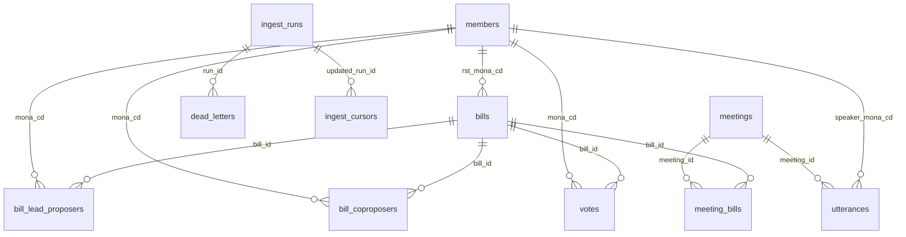

# ERD — Congress-DB (Postgres 16)

8개 핵심 테이블 + 카탈로그 1개 + 수집 운영 테이블 3개. core schema는 향후 검색 API/SDK에서 검색, 필터, 정렬, 조인, 결과 설명에 쓰이는 필드만 보존한다.

## Mermaid 다이어그램



## Core Tables

### 1. `members` — 의원

국회의원 인적사항. 자연키는 `MONA_CD`.

| 컬럼 | 타입 | 비고 |
|---|---|---|
| `mona_cd` | TEXT | **PK** |
| `hg_nm` | TEXT NOT NULL | 한글 이름 |
| `hj_nm` | TEXT | 한자 이름 |
| `eng_nm` | TEXT | 영문 이름 |
| `bth_date` | DATE | 생년월일 |
| `sex_gbn_nm` | TEXT | 성별 |
| `poly_nm` | TEXT | 현재 정당 |
| `orig_nm` | TEXT | 현재 선거구 |
| `elect_gbn_nm` | TEXT | 지역구 / 비례대표 |
| `cmits` | TEXT | 현재 위원회 원문 |
| `reele_gbn_nm` | TEXT | 초선 / 재선 등 |
| `units` | TEXT | 역대 대수 원문 |
| `tel_no` | TEXT | 공개 연락처 |
| `e_mail` | TEXT | 공개 이메일 |
| `homepage` | TEXT | 홈페이지 |
| `mem_title` | TEXT | 약력 |
| `assem_addr` | TEXT | 의원회관 호실 |
| `fetched_at` | TIMESTAMPTZ | 마지막 수집 시각 |

### 2. `bills` — 법안

법안과 의안의 검색 축. 자연키는 `BILL_ID`, 보조키는 사람이 읽기 쉬운 `BILL_NO`.

| 컬럼 | 타입 | 비고 |
|---|---|---|
| `bill_id` | TEXT | **PK** |
| `bill_no` | TEXT UNIQUE NOT NULL | 의안번호 |
| `bill_name` | TEXT NOT NULL | 법안명 |
| `propose_dt` | DATE | 발의일 |
| `rst_mona_cd` | TEXT REFERENCES members(mona_cd) | 단일 대표발의 편의 FK |
| `rst_proposer` | TEXT | 대표발의자 원문 |
| `publ_proposer` | TEXT | 공동발의자 원문 |
| `proposer` | TEXT | 제안자 문구 원문 |
| `committee` | TEXT | 소관 위원회명 |
| `committee_id` | TEXT | 소관 위원회 코드 |
| `proc_result` | TEXT | 처리결과 |
| `proc_dt` | DATE | 처리일자 |
| `law_proc_dt` | DATE | 법사위 처리일자 |
| `law_proc_result_cd` | TEXT | 법사위 처리결과 코드 |
| `committee_dt` | DATE | 위원회 회부일자 |
| `cmt_proc_dt` | DATE | 위원회 처리일자 |
| `cmt_proc_result_cd` | TEXT | 위원회 처리결과 코드 |
| `summary` | TEXT | 주요내용 |
| `detail_link` | TEXT | 의안 상세 링크. 검색 core에는 낮은 우선순위이며 hosted Postgres 전 제거 재검토 |
| `age` | SMALLINT | 대수. 22대만 유지하는 동안 제거 재검토 |
| `fetched_at` | TIMESTAMPTZ | 마지막 수집 시각 |

### 3. `bill_lead_proposers` — 대표발의 N:M

OpenAPI가 복수 대표발의자를 줄 수 있어 정규화한다.

| 컬럼 | 타입 | 비고 |
|---|---|---|
| `bill_id` | TEXT REFERENCES bills(bill_id) | **PK 일부** |
| `mona_cd` | TEXT REFERENCES members(mona_cd) | **PK 일부** |
| `order_no` | SMALLINT | 원문 순서 |

### 4. `bill_coproposers` — 공동발의 N:M

| 컬럼 | 타입 | 비고 |
|---|---|---|
| `bill_id` | TEXT REFERENCES bills(bill_id) | **PK 일부** |
| `mona_cd` | TEXT REFERENCES members(mona_cd) | **PK 일부** |
| `order_no` | SMALLINT | 원문 순서 |

### 5. `votes` — 본회의 표결

본회의 표결의 의원별 행. 의안 1건당 의원 수만큼 생성한다.

| 컬럼 | 타입 | 비고 |
|---|---|---|
| `id` | BIGSERIAL | **PK** |
| `bill_id` | TEXT REFERENCES bills(bill_id) NOT NULL | |
| `mona_cd` | TEXT REFERENCES members(mona_cd) NOT NULL | |
| `vote_date` | TIMESTAMPTZ NOT NULL | 표결 시각 |
| `result_vote_mod` | TEXT NOT NULL | 찬성/반대/기권/불참 |
| `poly_nm_at_vote` | TEXT | 표결 시점 정당 |
| `session_cd` | INT | 회기 |
| `currents_cd` | INT | 원천 코드 |
| | | **UNIQUE(bill_id, mona_cd)** |

### 6. `meetings` — 회의

HTML 회의록 목록의 한 회의. `total/22.do` 웹 목록이 canonical source이고, OpenAPI는 같은 `mnts_id`가 있을 때 메타데이터 보강에만 사용한다.

| 컬럼 | 타입 | 비고 |
|---|---|---|
| `mnts_id` | INT | **PK**. HTML viewer URL의 `id` |
| `title` | TEXT NOT NULL | 회의명/목록 표시명 |
| `meeting_type` | TEXT NOT NULL CHECK (...) | 본회의/상임위/특별위/국정감사/국정조사/인사청문회/소위원회. 예산결산특별위원회·인사청문특별위원회 등은 `meeting_type='특별위'`이고 `comm_name`으로 구분(별도 type 아님) |
| `conf_date` | DATE NOT NULL | 회의일 |
| `comm_name` | TEXT | 위원회명. 본회의는 NULL 가능 |
| `session_no` | INT | 회기 번호 |
| `degree` | TEXT | 제N차 / 개회식 등 |
| `is_temporary` | BOOLEAN NOT NULL DEFAULT FALSE | 웹 목록의 `[임시]` 표기 |
| `is_appendix` | BOOLEAN NOT NULL DEFAULT FALSE | 웹 목록의 `(부록)` 표기 |
| `fetched_at` | TIMESTAMPTZ | 마지막 수집 시각 |

제외 필드: PDF/HWP/VOD/요약 링크, `source_api`, `conf_id`, `class_name`, `comm_code`. 이 값들은 검색 API/SDK의 core query에 쓰이지 않으므로 coverage report, ingest summary, dead letter에서만 다룬다.

### 7. `meeting_bills` — 회의↔법안 N:M

법안이 어떤 회의에서 다뤄졌는지 찾기 위한 핵심 junction. `VCONFBILLCONFLIST`와 `SUB_NAME` 임시 파싱 결과를 합쳐 만든다.

| 컬럼 | 타입 | 비고 |
|---|---|---|
| `meeting_id` | INT REFERENCES meetings(mnts_id) | **PK 일부** |
| `bill_id` | TEXT REFERENCES bills(bill_id) | **PK 일부** |
| `source` | TEXT | `vconfbill` / `agenda` / `both` |

공식 회의 안건 원문은 별도 core 테이블로 보존하지 않는다. 법안이 아닌 안건은 정책 의제 검색과 직접 대응하지 않고, 필요한 경우 향후 의미 레이어에서 evidence 기반으로 모델링한다.

### 8. `utterances` — 발언

HTML viewer DOM에서 파싱한 발언 stream.

| 컬럼 | 타입 | 비고 |
|---|---|---|
| `id` | BIGSERIAL | **PK** |
| `meeting_id` | INT REFERENCES meetings(mnts_id) NOT NULL | |
| `sequence` | INT NOT NULL | 회의 내 발언 순번 |
| `speaker_name` | TEXT NOT NULL | 화자 이름 |
| `speaker_title` | TEXT NOT NULL | 화자 직함 |
| `speaker_mona_cd` | TEXT REFERENCES members(mona_cd) | 의원 매핑 nullable |
| `content` | TEXT NOT NULL | 발언 내용 |
| | | **UNIQUE(meeting_id, sequence)** |

## Operational Tables

### `api_catalog`

사용 확정 OpenAPI의 작동 여부와 22대 데이터 보유 여부를 기록한다. 회의록 HTML과 웹 목록은 OpenAPI가 아니므로 catalog가 아니라 별도 DOM/coverage 문서에서 관리한다.

### `ingest_runs`

백필, 증분 동기화, dead letter 재처리 실행 단위를 기록한다.

### `ingest_cursors`

source별 증분 기준점. 회의록은 웹 목록 전체 재대조 후 새 `mnts_id`와 임시/부록/title 변화가 있는 touched meeting을 계산한다.

### `dead_letters`

재시도 후에도 실패한 API item 또는 HTML 회의록 대상을 저장한다. 웹 목록에는 있지만 `type=view`가 400인 회의록은 PDF/HWP로 우회하지 않고 여기에서 명시 분류한다.

## 인덱스 후보

```sql
CREATE INDEX idx_members_hg_nm ON members(hg_nm);
CREATE INDEX idx_bills_rst ON bills(rst_mona_cd);
CREATE INDEX idx_bills_propose_dt ON bills(propose_dt DESC);
CREATE INDEX idx_coproposers_mona ON bill_coproposers(mona_cd);
CREATE INDEX idx_votes_mona ON votes(mona_cd);
CREATE INDEX idx_votes_bill ON votes(bill_id);
CREATE INDEX idx_votes_date ON votes(vote_date DESC);
CREATE INDEX idx_meetings_date ON meetings(conf_date DESC);
CREATE INDEX idx_meetings_type ON meetings(meeting_type);
CREATE INDEX idx_meetings_comm ON meetings(comm_name);
CREATE INDEX idx_meetings_type_date ON meetings(meeting_type, conf_date DESC);
CREATE INDEX idx_mb_bill ON meeting_bills(bill_id);
CREATE INDEX idx_utterances_meeting ON utterances(meeting_id);
CREATE INDEX idx_utterances_speaker ON utterances(speaker_mona_cd) WHERE speaker_mona_cd IS NOT NULL;

CREATE EXTENSION IF NOT EXISTS pg_trgm;
CREATE INDEX idx_bills_bill_name_trgm ON bills USING gin (bill_name gin_trgm_ops);
CREATE INDEX idx_bills_summary_trgm ON bills USING gin (summary gin_trgm_ops) WHERE summary IS NOT NULL;
CREATE INDEX idx_utterances_content_trgm ON utterances USING gin (content gin_trgm_ops);
```
