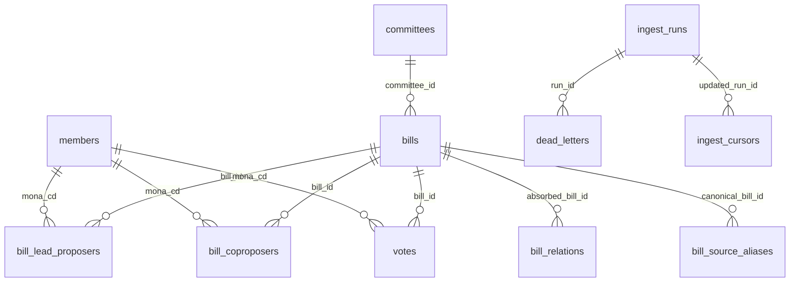

# ERD — Congress-DB (Postgres 16)

7개 핵심 테이블 + committee dimension 1개 + source alias 테이블 1개 + final outcome 테이블 1개 + 수집 운영 테이블 3개. core schema는 직접 SQL 소비자가 검색, 필터, 정렬, 조인, 결과 설명에 쓰는 필드만 보존한다.

> **회의·발언 도메인 제거 (2026-06-28, `migrations/031_drop_meeting_minutes.sql`):** `meetings`·`meeting_bills`·`utterances` 테이블, `bill_meeting_contexts` 뷰, `search_utterances` 함수는 삭제됐다. "누가 무엇을 말했나" 심층 분석은 websearch 영역으로 옮겼고, 심의 *진행·상태*는 구조화 테이블(`bills.proc_result`·`bill_lineage`·`bill_final_outcomes`)이 답한다. 배경은 [DECISIONS.md](DECISIONS.md) 2026-06-28 참조.

> **LLM 직접-SQL 소비자용:** 함정·어휘·커버리지 경고는 스키마 `COMMENT`(`migrations/011_schema_comments.sql` 등, `\d+`로 introspect 시 인라인으로 보임)에 있고, introspection이 조립 못 하는 cross-table 레시피만 [DB-QUERY-GUIDE.md](DB-QUERY-GUIDE.md)에 있다.

## Mermaid 다이어그램



## Core Tables

### 1. `members` — 의원

국회의원 인적사항. 자연키는 `MONA_CD`.

| 컬럼 | 타입 | 비고 |
|---|---|---|
| `mona_cd` | TEXT | **PK** |
| `hg_nm` | TEXT NOT NULL | 한글 이름 |
| `hj_nm` | TEXT | 한자 이름 |
| `eng_nm` | TEXT | 영문 이름 |
| `bth_date` | DATE | 생년월일 |
| `sex_gbn_nm` | TEXT | 성별 |
| `poly_nm` | TEXT | 현재 정당 |
| `orig_nm` | TEXT | 현재 선거구. 선출구분(비례대표/지역구)은 여기서 도출 |
| `units` | TEXT | 역대 대수 원문 |
| `is_incumbent` | BOOLEAN NOT NULL DEFAULT FALSE | 최신 의원 인적사항 명부 등장 여부에서 파생한 현직 여부 |
| `fetched_at` | TIMESTAMPTZ | 마지막 수집 시각 |

### 2. `committees` — 법안 소관 위원회/기관

법안 source의 `committee_id -> committee_name` 정본. 위원회 membership/history가 아니라 bill-side 소관/회부 기관명이다.

| 컬럼 | 타입 | 비고 |
|---|---|---|
| `committee_id` | TEXT | **PK**. 법안 source의 소관 위원회/기관 코드 |
| `committee_name` | TEXT UNIQUE NOT NULL | 표시명/원천명 |

### 3. `bills` — 법안

법안과 의안의 검색 축. 자연키는 `BILL_ID`, 보조키는 사람이 읽기 쉬운 `BILL_NO`.

| 컬럼 | 타입 | 비고 |
|---|---|---|
| `bill_id` | TEXT | **PK** |
| `bill_no` | TEXT UNIQUE NOT NULL | 의안번호 |
| `bill_name` | TEXT NOT NULL | 법안명 |
| `propose_dt` | DATE | 발의일 |
| `proposer_raw` | TEXT | 국회 API `PROPOSER` 원천 문구. 대표/공동발의자 identity는 junction 테이블이 정본 |
| `committee_id` | TEXT REFERENCES committees(committee_id) | 소관 위원회/기관 코드 |
| `proc_result` | TEXT | 처리결과 |
| `proc_dt` | DATE | 처리일자 |
| `law_proc_dt` | DATE | 법사위 처리일자 |
| `committee_dt` | DATE | 위원회 회부일자 |
| `cmt_proc_dt` | DATE | 위원회 처리일자 |
| `cmt_proc_result` | TEXT | 위원회 처리결과(라벨) |
| `summary` | TEXT | 주요내용 |
| `fetched_at` | TIMESTAMPTZ | 마지막 수집 시각 |
| `is_law_bill` | BOOLEAN GENERATED ALWAYS … STORED | 법률안(공포 대상) 여부(`bill_name ~ '법(률)?안'`, `migrations/037`). 가결-미공포를 계류/거부권 후보로 좁힐 때 사용 |

### 4. `bill_relations` — 대안 관계

대안반영폐기·수정안반영폐기된 원안과 그 내용을 흡수한 대안/수정안 법안을 연결한다. 출처는 의안정보시스템(likms) `billDetail.do`의 hidden `selRefBillId`.

> **소비자 비노출 (ops-internal, `congress_ro` REVOKE #125):** 소비자는 폐기원안→해소된 canonical 대안 계보를 **`bill_lineage` 뷰**로 읽는다(direct+alias 해소를 캡슐화, `relation_type`은 `proc_result`에서, 소관위-종료 원안은 `cmt_proc_result`에서 파생 노출(C1), 미해소면 `alternative_bill_id=NULL`). 이 raw 테이블과 `bill_source_aliases`는 ETL 전용이다. 증분은 미보유분만 스크랩(missing-only) — 본회의 폐기 + 소관위-종료 폐기 원안 모두 대상(WI2·C1).

| 컬럼 | 타입 | 비고 |
|---|---|---|
| `absorbed_bill_id` | TEXT REFERENCES bills(bill_id) | **PK**. 폐기된 원안 |
| `alternative_bill_id` | TEXT NOT NULL | likms `selRefBillId`. 내용을 흡수한 대안/수정안 source key. 현재 `bills`에 row가 있으면 join 가능하나 FK로 강제하지 않는다(DECISIONS 2026-06-06) |
| `relation_type` | TEXT NOT NULL CHECK (...) | `대안반영` / `수정안반영` |
| `fetched_at` | TIMESTAMPTZ | 마지막 수집 시각 |

### 4a. `bill_source_aliases` — source별 법안 ID alias

source마다 갈릴 수 있는 `BILL_ID`를 안정적인 `BILL_NO`를 경유해 canonical `bills` row로 연결한다. `bill_relations.alternative_bill_id`는 source key로 보존하고, 이 테이블이 canonical 연결을 담당한다. (소비자 비노출 — `bill_relations`와 함께 ETL 전용, 소비자는 `bill_lineage` 뷰; #125.)

| 컬럼 | 타입 | 비고 |
|---|---|---|
| `source` | TEXT NOT NULL | **PK 일부**. source id의 출처 |
| `source_bill_id` | TEXT NOT NULL | **PK 일부**. source가 제공한 `BILL_ID` |
| `bill_no` | TEXT | source detail에서 확인한 안정 의안번호 |
| `canonical_bill_id` | TEXT REFERENCES bills(bill_id) | 기존 `bills` row. 해소 불가 gap은 row를 만들지 않으므로 nullable |
| `fetched_at` | TIMESTAMPTZ | 마지막 해소 시각 |

### 4b. `bill_final_outcomes` — 최종 처리·공포 이력

ALLBILL이 제공하는 본회의 의결 이후 정부이송·공포 이력을 `BILL_NO` 기준으로 보존한다. `bills.law_proc_dt`는 법사위 처리일자에 가까우므로 공포일로 사용하지 않는다. 시행일자와 현행법 본문은 이 DB에 없고 법제처/외부 법령 데이터 소스에서 확정한다.

| 컬럼 | 타입 | 비고 |
|---|---|---|
| `bill_no` | TEXT REFERENCES bills(bill_no) | **PK**. source 간 안정 의안번호 |
| `plenary_dt` | DATE | 본회의 의결일 (`RGS_RSLN_DT`) |
| `govt_transfer_dt` | DATE | 정부이송일 (`GVRN_TRSF_DT`) |
| `promulgation_dt` | DATE | 공포일 (`PROM_DT`) |
| `prom_no` | TEXT | 공포번호 (`PROM_NO`) |
| `prom_law_nm` | TEXT | 공포 법률명 (`PROM_LAW_NM`) |
| `prom_law_nm_norm` | TEXT GENERATED ALWAYS … STORED | `prom_law_nm` 정규화(중점 U+318D→U+00B7 + 공백 제거, `migrations/038`). 법제처 등 외부 법령명 매칭용(상대측도 같은 정규화 필요; 1차 키는 `prom_no`) |
| `fetched_at` | TIMESTAMPTZ | 마지막 수집 시각 |

> **증분 편입 (WI1, 2026-07-19):** `bill_final_outcomes`는 이제 증분 파이프라인 스테이지로 매일 채워진다 — 신규 가결분 outcome 생성 + 공포 대기(`promulgation_dt IS NULL`) 법률안 재조회(재의결로 `plenary_dt` 갱신 반영). upsert는 비파괴(`COALESCE(EXCLUDED, 기존)`).

### 5. `bill_lead_proposers` — 대표발의 N:M

OpenAPI가 복수 대표발의자를 줄 수 있어 정규화한다.

| 컬럼 | 타입 | 비고 |
|---|---|---|
| `bill_id` | TEXT REFERENCES bills(bill_id) | **PK 일부** |
| `mona_cd` | TEXT REFERENCES members(mona_cd) | **PK 일부** |
| `order_no` | SMALLINT | 원문 순서 |

### 6. `bill_coproposers` — 공동발의 N:M

| 컬럼 | 타입 | 비고 |
|---|---|---|
| `bill_id` | TEXT REFERENCES bills(bill_id) | **PK 일부** |
| `mona_cd` | TEXT REFERENCES members(mona_cd) | **PK 일부** |
| `order_no` | SMALLINT | 원문 순서 |

### 7. `votes` — 본회의 표결

본회의 표결의 의원별 행. 의안 1건당 의원 수만큼 생성한다.

| 컬럼 | 타입 | 비고 |
|---|---|---|
| `bill_id` | TEXT REFERENCES bills(bill_id) NOT NULL | **PK 일부** |
| `mona_cd` | TEXT REFERENCES members(mona_cd) NOT NULL | **PK 일부** |
| `vote_date` | TIMESTAMPTZ NOT NULL | 표결 시각(GMT 세션 — 일 단위 비교엔 `vote_date_kst` 사용) |
| `vote_date_kst` | DATE GENERATED ALWAYS … STORED | 한국(KST) 달력일(`migrations/032`). 일 단위 비교·DATE 컬럼 조인용 |
| `result_vote_mod` | TEXT NOT NULL | 찬성/반대/기권/불참 — **불참은 저장값 약 1/4**(빠진 행 아님; 출석 분모는 불참 제외) |
| `poly_nm_at_vote` | TEXT | 표결 시점 정당 |

> **재의결 표결 부재 (WI3, `migrations/035`):** 대통령 거부권 후 재의결된 법안은 본회의 표결이 두 번이나 원천 API가 원표결만 제공해 `votes`엔 하나만 있다. 재의결 여부는 `bill_final_outcomes.plenary_dt > bills.proc_dt`로 식별하고, 부재한 재의결 표결의 표는 회의록·websearch로 확인한다.

> **회의·발언 도메인(`meetings`·`meeting_bills`·`utterances`)은 2026-06-28 `migrations/031_drop_meeting_minutes.sql`에서 제거됐다.** 이 ERD에는 더 이상 포함하지 않는다.

## 소비 뷰 (consumer views — owner 권한으로 실행돼 REVOKE된 ETL 테이블도 캡슐화 노출)

### `bill_lineage` — 폐기 원안 → 흡수 canonical 대안 계보 (`migrations/023`·`036`)

`bill_relations` + `bill_source_aliases` 해소를 캡슐화한 소비 표면(raw 두 테이블은 `congress_ro` REVOKE). `relation_type`은 `bills.proc_result`에서 파생하되, **소관위-종료 원안(`proc_result` NULL·`cmt_proc_result` 폐기)은 `cmt_proc_result`에서 파생**한다(WI2·C1, `migrations/036`). 본회의·소관위 종료 폐기 원안을 모두 스크랩하므로 0행이면 대체로 진짜 미흡수(잔여 갭은 `selRefBillId` 부재 소수 — 뷰 COMMENT COVERAGE).

### `data_freshness` — 스테이지별 신선도 (`migrations/034`, WI4)

도메인(`bills`·`members`·`votes`·`bill_final_outcomes`·`bill_relations`)별 1행: `last_ingest_at`(그 도메인 최신 `fetched_at`; votes는 미보유라 NULL), `latest_fact_date`(도메인 최신 사실 날짜 — bills=최신 발의일, votes=최신 표결일, outcomes=최신 공포일). 최신 현황·미공포·계류를 단정하기 전 이 뷰로 기준일을 확인하고 산출물에 병기한다(스테이지마다 수집 시점이 달라 '없음'이 미수집일 수 있음).

## Operational Tables

### `ingest_runs`

백필, 증분 동기화, dead letter 재처리 실행 단위를 기록한다.

### `ingest_cursors`

source별 증분 기준점. 각 source가 마지막으로 성공 처리한 시점을 관찰·감사용으로 보존한다.

### `dead_letters`

재시도 후에도 실패한 API item을 저장한다.

## 인덱스 후보

> 아래는 설계 의도를 보여주는 **예시 목록**이고 실제 인덱스와 1:1로 동기화하지 않는다(라이브가 더 많음 — 예: `idx_members_poly_nm`, `idx_bills_proc_result`, `idx_lead_proposers_mona`, `idx_bills_committee_proc_dt`). 실제 인덱스는 `\di` 또는 `pg_indexes`로 introspect한다.

```sql
CREATE INDEX idx_members_hg_nm ON members(hg_nm);
CREATE INDEX idx_bills_propose_dt ON bills(propose_dt DESC);
CREATE INDEX idx_bills_committee_proc_dt ON bills(committee_id, proc_dt DESC) WHERE committee_id IS NOT NULL;
CREATE INDEX idx_bill_relations_alternative ON bill_relations(alternative_bill_id);
CREATE INDEX idx_bill_source_aliases_canonical_bill_id ON bill_source_aliases(canonical_bill_id) WHERE canonical_bill_id IS NOT NULL;
CREATE INDEX idx_coproposers_mona ON bill_coproposers(mona_cd);
CREATE INDEX idx_votes_mona ON votes(mona_cd);
CREATE INDEX idx_votes_bill ON votes(bill_id);
CREATE INDEX idx_votes_date ON votes(vote_date DESC);
CREATE EXTENSION IF NOT EXISTS pg_trgm;
CREATE INDEX idx_bills_bill_name_trgm ON bills USING gin (bill_name gin_trgm_ops);
CREATE INDEX idx_bills_summary_trgm ON bills USING gin (summary gin_trgm_ops) WHERE summary IS NOT NULL;
```

## 검색 지원 함수

```sql
search_snippet(source_text TEXT, query_text TEXT, radius INT DEFAULT 80) RETURNS TEXT;
search_bills(query_text TEXT, result_limit INT DEFAULT 50)
  RETURNS TABLE (bill_id, bill_no, bill_name, propose_dt, snippet, similarity_score);
```

첫 검색 랭킹은 Postgres `pg_trgm`의 `similarity()` 내림차순이다. 직접 SQL 소비자는 이 DB 함수를 우선 사용하고, 벡터/PGroonga는 측정된 recall 실패가 생길 때만 추가한다.
